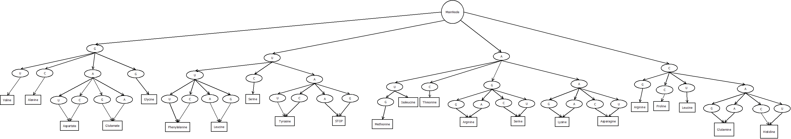

# Gene Engine
To create an translation of genome data to something quantifiable by ML
programs we need to create an engine that can handle and vectorize any transformation
of the data.

### Gene Base: Gene Class
This allows the program to take in data and clean the genome to have
data that only pertains to a DNA structure (containing 'g', 't', 'c', or 'a')
and allows for seamless operation on the data. Plan to have this also have the
ability to read a FASTA file and create a Gene class object.

### Gene Base: Preloaded Data Gene
Allows the user to create genes with pre-calculated data as to avoid long
calculation times down the pipeline.

### Codon Translation Tree
In the figure below you can see a graph of the engine's codon translation tree.
This greatly will increase the translation process and reducing the size of 
genomes by a tri-gram-like split will hopefully greatly improve AI applications
such as protein and genome generation or classification.
