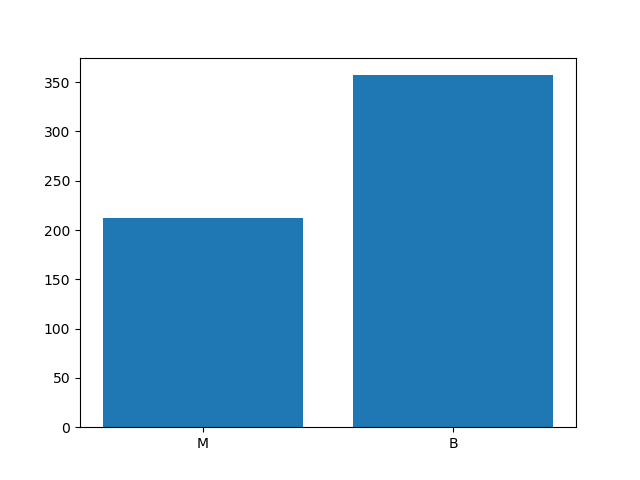
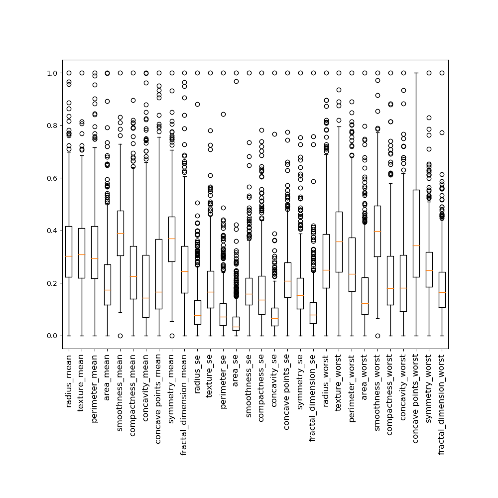
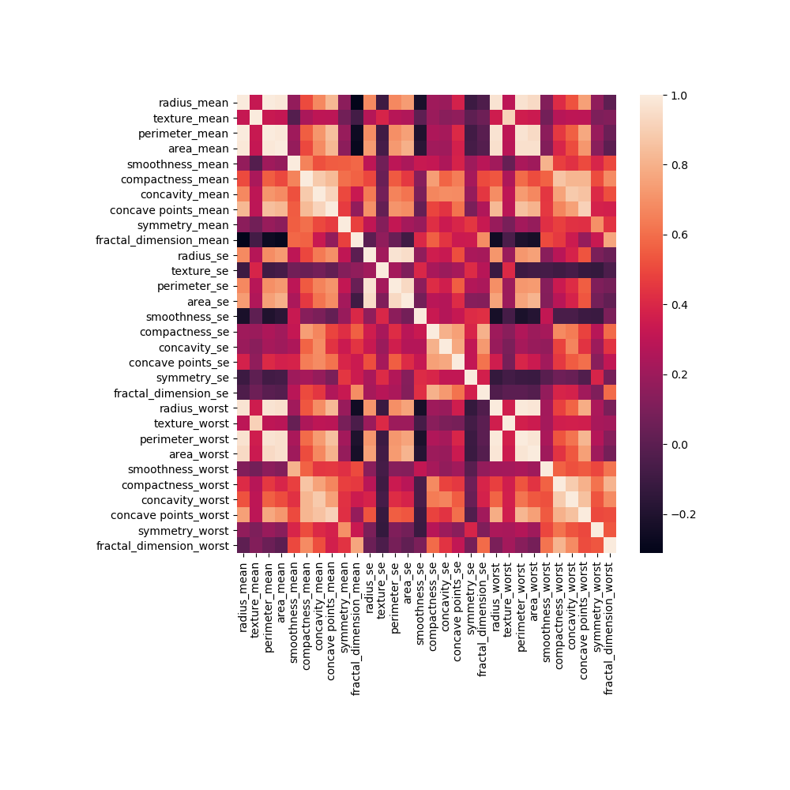
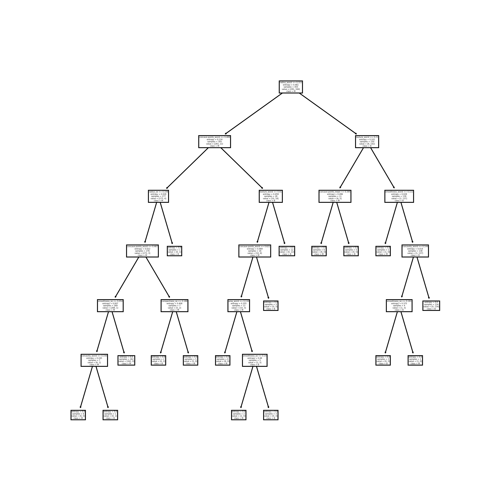

# Wisconson Breast Cancer Dataset

### Dataset Metrics

#### Class Distribution

Malignant: 37.258%
Bengin: 62.742%

In the figure below you can see the number of occurrences fo each class.

In the figure below you can see the distribution of values for each row.
The number of outliers most likely indicates/correlates with the malignant
cases.

In the figure below we show the correlation of all properties in the data
against itself. There are some hotspots where the correlation is fairly high
though this is probably due to the data having clusters of data for each 
property.

### AI Model

The model that I chose to implement was sklearn's Decision Tree model.
In the figure below you can see a visualization of the model.

Accuracy: 0.956140350877193

Precision: 0.9848484848484849

Recall: 0.9420289855072463

F1 Score: 0.962962962962963
    
Confusion Matrix:

 [[65  1]
 
 [ 4 44]]